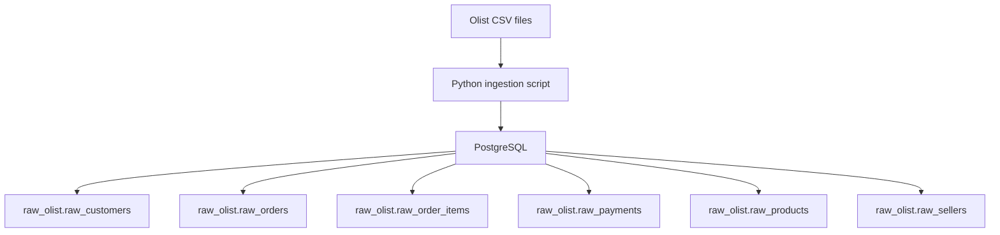

# Olist E-Commerce & Supply Chain Intelligence

This project is an end-to-end data platform that powers analytics for a Brazilian e-commerce marketplace ecosystem. It ingests millions of transaction records from Olist sellers and transforms raw operational data into a trusted, production-grade analytical foundation.

The architecture is built around three core stages:

* **Ingestion & Storage**: Automated CSV ingestion from Olist datasets into PostgreSQL raw schema, with built-in row validation and data lineage tracking.
* **Transformation & Modeling**: ELT data warehouse built with dbt Core, featuring historical tracking using Slowly Changing Dimensions (SCD Type 2) for products and sellers, and comprehensive dimensional models for orders, payments, and logistics.
* **Monitoring & Quality**: Rigorous Data Quality framework with automated health checks and Data Health Tiles that ensure analytical reliability across the entire pipeline.

The result is a governed data ecosystem that delivers trustworthy insights into marketplace performance, seller health, customer behavior, and supply chain efficiency.

## Current architecture



## Stack

- Ubuntu
- Docker 
- PostgreSQL 
- Python 
## Project structure
 
```
.
├── database/
│   ├── init/
│   │   └── 01_create_schema.sql
│   └── sql/
│       └── 01_create_raw_tables.sql
├── scripts/
│   └── load_raw.py
├── data/              # ignored by Git
├── .env               # ignored by Git
├── docker-compose.yml
├── requirements.txt
└── README.md
```


## Phase 1

The first phase focuses on building the PostgreSQL raw layer and preparing the project for dbt transformations.

### Current step

- PostgreSQL container
- `raw_olist` schema
- Six raw tables
- Automated CSV ingestion
- Row-count validation

## Data ingestion

The `scripts/load_raw.py` script:

1. checks that the expected CSV files exist;
2. connects to PostgreSQL using environment variables;
3. truncates the raw tables;
4. loads the CSV files using PostgreSQL `COPY`;
5. validates the loaded row counts.

