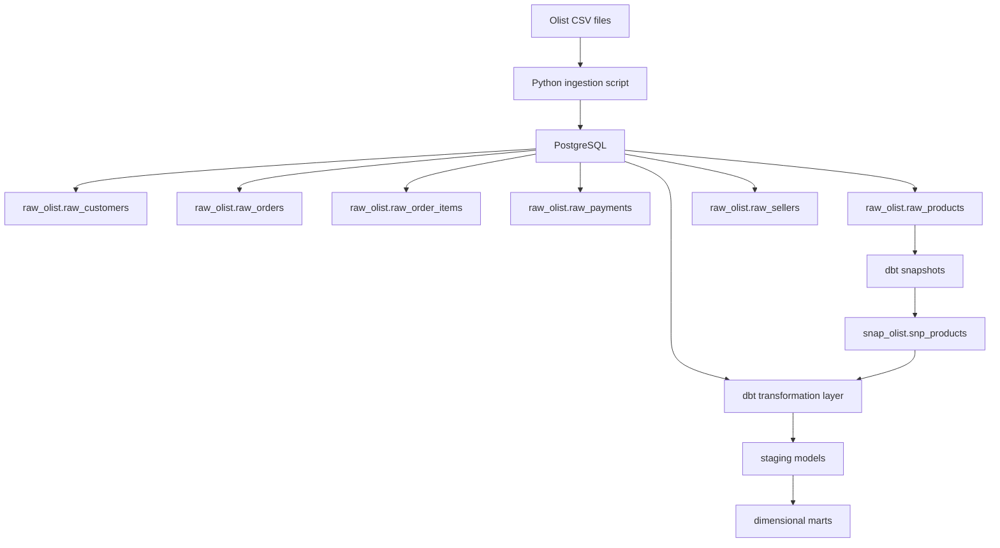

# Olist E-Commerce & Supply Chain Intelligence

This project is an end-to-end data platform that powers analytics for a Brazilian e-commerce marketplace ecosystem. It ingests millions of transaction records from Olist sellers and transforms raw operational data into a trusted, production-grade analytical foundation.

The architecture is built around three core stages:

* **Ingestion & Storage**: Automated CSV ingestion from Olist datasets into PostgreSQL raw schema, with built-in row validation and data lineage tracking.
* **Transformation & Modeling**: ELT data warehouse built with dbt Core, featuring historical tracking using Slowly Changing Dimensions (SCD Type 2) for products and sellers, and comprehensive dimensional models for orders, payments, and logistics.
* **Monitoring & Quality**: Rigorous Data Quality framework with automated health checks and Data Health Tiles that ensure analytical reliability across the entire pipeline.

The result is a governed data ecosystem that delivers trustworthy insights into marketplace performance, seller health, customer behavior, and supply chain efficiency.

## Current architecture



## Stack

- Ubuntu
- Docker 
- PostgreSQL 
- Python 
- dbt Core
- dbt-postgres
## Project structure
 
```
.
├── database/
│   ├── init/
│   │   └── 01_create_schema.sql
│   └── sql/
│       └── 01_create_raw_tables.sql
│
├── scripts/
│   └── load_raw.py
│
├── dbt_project/
│   ├── analyses/
│   ├── macros/
│   ├── models/
│   │   └── sources.yml
│   ├── snapshots/
│   │   └── snp_products.sql
│   ├── seeds/
│   ├── tests/
│   ├── dbt_project.yml
│   ├── packages.yml
│   ├── package-lock.yml
│   └── profiles.yml.example
│
├── data/              # ignored by Git
├── .env               # ignored by Git
├── docker-compose.yml
├── requirements.txt
└── README.md
```


## Phase 1

The first phase focuses on building the PostgreSQL raw layer and preparing the project for dbt transformations.

### Data ingestion

The `scripts/load_raw.py` script:

1. checks that the expected CSV files exist;
2. connects to PostgreSQL using environment variables;
3. truncates the raw tables;
4. loads the CSV files using PostgreSQL `COPY`;
5. validates the loaded row counts.

### dbt setup

The dbt transformation layer is initialized under the `dbt_project/` directory.

The current dbt setup includes:

- dbt Core with the PostgreSQL adapter;
- PostgreSQL connection configuration;
- `dbt_project.yml` project configuration;
- `dbt_utils` package;
- `dbt_expectations` package;
- `package-lock.yml` for dependency version locking;
- `profiles.yml.example` as an anonymized PostgreSQL profile template.

The local dbt profile is stored in `~/.dbt/profiles.yml` and is not committed to the repository because it contains database credentials.

## dbt snapshots — SCD Type 2

The first historical model is the product snapshot:`dbt_project/snapshots/snp_products.sql`
It reads from: `raw_olist.raw_products` and creates:`snap_olist.snp_products`

Because the raw Olist products dataset does not contain an update timestamp, the snapshot uses dbt's `check` strategy to detect changes in product attributes.
Tracked attributes include:

* `product_category_name`
* `product_name_lenght`
* `product_description_lenght`
* `product_photos_qty`
* `product_weight_g`
* `product_length_cm`
* `product_height_cm`
* `product_width_cm`

dbt maintains the historical validity of each version through metadata columns such as:

* `dbt_valid_from`
* `dbt_valid_to`

When a tracked attribute changes, dbt closes the previous version and creates a new version rather than overwriting the historical record.

The SCD Type 2 behavior was validated by changing a product's weight in the raw layer, running the snapshot, and verifying that two versions of the product were preserved in `snap_olist.snp_products`.

